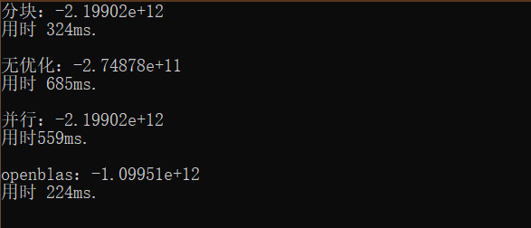
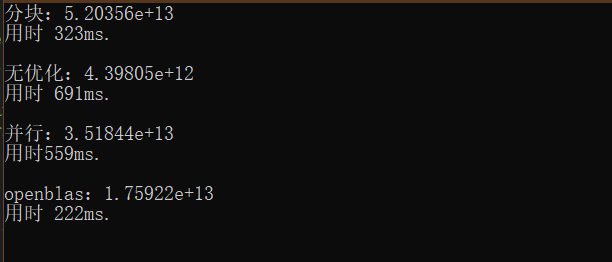
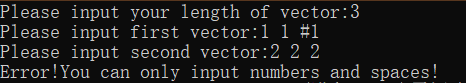
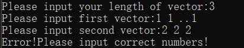
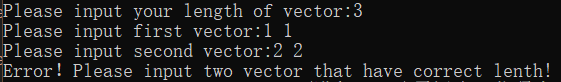
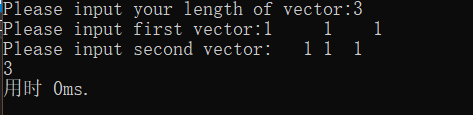
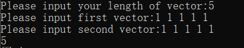
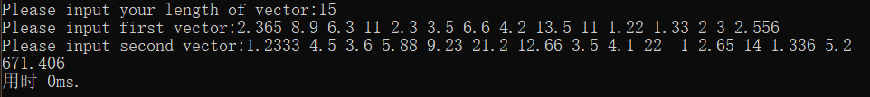

# DotProduct 
## 由于网络问题，图片可能需要一定时间加载。若图片长时间未加载成功，请刷新网页。谢谢！
## 主要功能：
* 能够在合理的精度范围内较为高效地进行两个向量的点积计算。
* 能够处理用户的各种异常输入，并指出错误类型。
* 可以支持任意长度向量的点积计算。
## 主要思路：
* 对于较大长度的向量，例如200M，正常算法是进行两亿次循环，每次循环两向量的分量相乘再相加。本程序使用分块的思想对其进行优化，使得其运算速度能够在正常基础上提高3到4倍。
## 包含文件：
* 本项目共包含两个源代码文件`Dot1.cpp`和`Dot2.cpp`。其中Dot1.cpp是用于对较长向量乘法进行运算测试。测试数据共4个.dat文件，分为两组，代表两组长度为200M的向量。我用不同的算法对这两组向量的点积进行了计算，测试了它们所需的运算时间，并且引入了openblas中的cblas—sdot（）函数进行对比。
* Dot2.cpp是实际用户可以使用的程序代码。其主要功能见上。
## 测试程序：
### 我在测试程序中测试了四种算法的速度。各个算法如下：
* 不做任何优化：
  
   * ```c++
     for (int i = 0; i < 200000000; i++)
     	{
     		sum2 += v1[i] * v2[i];
     	}
     ```
* 分块处理：
  
   * ```c++
     for (int i = 0; i < 199999990; i += 10)
     	{
     		sum1 += v1[i] * v2[i]
     			+ v1[i + 1] * v2[i + 1]
     			+ v1[i + 2] * v2[i + 2]
     			+ v1[i + 3] * v2[i + 3]
     			+ v1[i + 4] * v2[i + 4]
     			+ v1[i + 5] * v2[i + 5]
     			+ v1[i + 6] * v2[i + 6]
     			+ v1[i + 7] * v2[i + 7]
     			+ v1[i + 8] * v2[i + 8]
     			+ v1[i + 9] * v2[i + 9];
     	}
     ```
   
     这里将每个循环中的加法做了分块处理，减少循环次数。
* 并行处理：
  
   * ```c++
     for (int i = 0; i < 199999992; i +=8)
     	{
     		p1 += v1[i] * v2[i];
     		p2 += v1[i + 1] * v2[i + 1];
     		p3 += v1[i + 2] * v2[i + 2];
     		p4 += v1[i + 3] * v2[i + 3];
     		p5 += v1[i + 4] * v2[i + 4];
     		p6 += v1[i + 5] * v2[i + 5];
     		p7 += v1[i + 6] * v2[i + 6];
     		p8 += v1[i + 7] * v2[i + 7];
     	}
     	sum3 += p1 + p2 + p3 + p4 + p5 + p6 + p7 + p8;
     ```
   
     这里思路与分块类似，通过将总和sum3拆分为若干个分和最后再相加以减少循环次数，提高效率。
* openblas中的cblas_sdot()函数：
  
   * ```c++
     sum4 = cblas_sdot(200000000, v1, 1, v2, 1);
     ```
   
     这里使用了openblas中的cblas_sdot()函数来与上述方法进行对比。
* 测试结果如下：
   
   * 
   * 
   * 以上两个结果所用测试数据分别为两组个数为200M，范围-1000——1000的浮点数。可以看到用float进行两亿次计算后精度损失非常大。单从效率来看，分块要优于并行，固以下主程序设计中我的计算将用分块处理。
## 主程序：
####  输入&输出：
* 用户首先需要输入向量的长度。

  ```c++
  cout << "Please input your length of vector:";
  	cin >> len;
  	cin.get();
  ```
  
* 然后以字符串形式输入两个向量。这里用户只能输入数字（支持小数）和空格，其余符号均为非法符号。
  
  ```c++
  cout << "Please input first vector:";
  	getline(cin, s1);
  cout << "Please input second vector:";
  	getline(cin, s2);
  ```
  
 * 通过两个检查函数`check1（）`和`check2（）`来处理输入异常。check1（）检查是否存在非法符号，check2（）检查每个数字小数点个数和位置是否正确。代码如下：
  
   ```c++
   bool check1(string s)
   {
   	bool b1= 1;
   	for (int i = 0; i < s.size(); i++)
   	{
   		if ((s[i] >= 48 && s[i] <= 57) || s[i] == '.' || s[i] == ' ') continue;
   		else b1= 0;
   	}
   	return b1;
   }
   ```
   
   ```c++
   int check2(string s)
   {
   	int n = 0;
   	float f;
   	for (int i = 0; i < s.size(); i++)
   	{
   		if (n == -1) break;
   		if (s[i] == '.')
   		{
   			n = -1;
   			break;
   		}
   		if (s[i] >= 48 && s[i] <= 57)
   		{
   			if (i == s.size() - 1) n++;
   			for (int j = i+1; j < s.size(); j++)
   			{
   				if (j == s.size() - 1)
   				{
   					++j;
   					try
   					{
   						f = stod(s.substr(i, j - i));
   					}
   					catch (const std::exception&)
   					{
   						n = -1;
   						break;
   					}
   					if (n != -1) n++;
   					i = j - 1;
   					break;
   				}
   				if (s[j] == ' ')
   				{
   					try
   					{
   						f=stof(s.substr(i, j - i));
   					}
   					catch (const std::exception&)
   					{
   						n = -1;
   						break;
   					}
   					if (n != -1) n++;
   					i = j;
   					break;
   				}
   			}
   		}
   	}
   	return n;
   }
   ```
   * 这里check2（）在处理异常的同时还记录了该字符串内所含数字的多少。
 * 以下是一些异常输入以及对应的输出结果：
   
   * 
   * 
   * 
   * 
 * 以上便是对输入异常处理的部分。
#### 计算部分：
* 计算采用分组的方法，先将两个向量的各个分量存入两个动态数组，再每十个为一组进行运算。最后再计算余下的小于十个的部分。代码如下：

   ```c++
  int r = len % 10;
  	for (int i = 0; i < len - r; i += 10)
  	{
  		sum += v1[i] * v2[i]
  			+ v1[i + 1] * v2[i + 1]
  			+ v1[i + 2] * v2[i + 2]
  			+ v1[i + 3] * v2[i + 3]
  			+ v1[i + 4] * v2[i + 4]
  			+ v1[i + 5] * v2[i + 5]
  			+ v1[i + 6] * v2[i + 6]
  			+ v1[i + 7] * v2[i + 7]
  			+ v1[i + 8] * v2[i + 8]
  			+ v1[i + 9] * v2[i + 9];
  	}
  	if (r != 0)
  	{
  		for (int i = 0; i < r; i++)
  		{
  			sum += v1[len - r + i] * v2[len - r + i];
  		}
  	}
  ```
   * 结果测试：
   * 
   * 

 *以上便是我在此次作业中完成的功能。本次作业我花费时间较长，有很大一部分时间在处理计算的精度问题。我在测试代码中也通过字符串的处理方式写了小数高精度乘法，但在200M数据情况下运行所花费时间极其长久，完全没有应用价值。的确既想要精度又想要速度是很难实现的。本次优化算法其实比较简单，但是效率的提升还是比较明显。最终的结果无论是在精度还是速度上都与openblas有较大差距，但在不断优化尝试的过程中我也收益良多。

# 感谢阅读！
